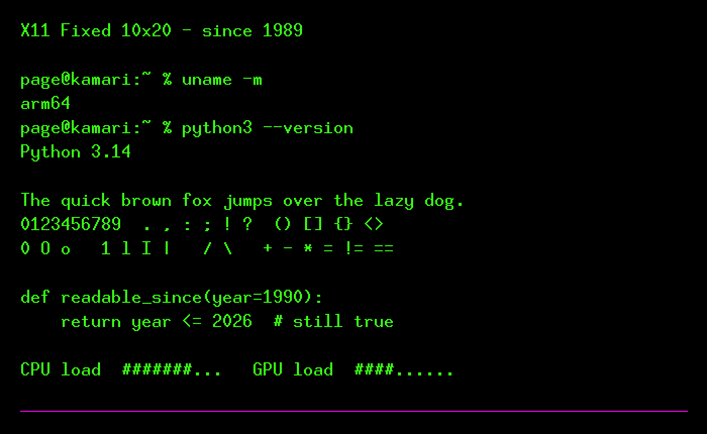
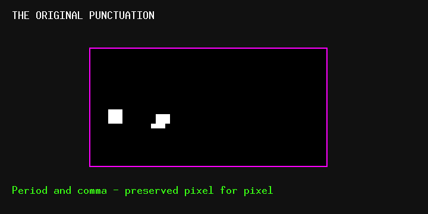

# X11 Fixed 10×20

> **The terminal font that never needed replacing.**



This project preserves two editions of the classic X11 **Misc Fixed 10×20**:

1. **FixedRegular Original** — Christian Pagé's own 2003 Mac conversion. It is
   a native 20 px Apple bitmap SFNT, recovered intact from its resource fork.
   This is the exact face shown in the specimens and recommended on macOS.
2. **X11 Fixed 10×20 Unicode** — a portable outline TTF carrying 5,204 encoded
   characters from the X.Org Unicode PCF. It offers broad coverage, but its
   vector rendering is intentionally documented as different from the original.

The original was designed at Network Computing Devices in 1989. Christian
Pagé began using it on a black-and-white X terminal around 1990, converted it
when Mac OS X arrived, exporting `FixedRegular` with FontLab 3 in 2003, and
still uses it in Terminal on an Apple M4 Max in 2026. This repository preserves
that line of continuity.

## Why it still works

- A strict 10×20 cell and consistent monospace rhythm.
- Crisp operators, brackets and numerals at terminal sizes.
- High information density without visual noise.
- More than nostalgia: decades of comfortable daily reading.

Its one admitted weakness is the small difference between period and comma.
The original face keeps both untouched. Any future accessibility variant will
have a different family name.



## Install on macOS

Download a release, unpack it and double-click `install.command`. If Gatekeeper
asks, Control-click the file and choose **Open**.

Manual installation:

```sh
sudo cp fonts/ttf/Fixed20-Original.ttf /Library/Fonts/
sudo cp fonts/ttf/X11Fixed10x20-Regular.ttf /Library/Fonts/
```

or if not using sudo, to install it for your user only:

```sh
mkdir -p ~/Library/Fonts
cp fonts/ttf/Fixed20-Original.ttf ~/Library/Fonts/
cp fonts/ttf/X11Fixed10x20-Regular.ttf ~/Library/Fonts/
```

Choose **Fixed** at size **20** in Terminal for the exact historical rendering.
Choose **X11 Fixed 10x20** only when you need the larger Unicode repertoire.

## Install on Linux

```sh
mkdir -p ~/.local/share/fonts
cp fonts/ttf/X11Fixed10x20-Regular.ttf ~/.local/share/fonts/
fc-cache -f
```

The historical PCF files are also available under `fonts/original/iso/` for
X11 installations that support bitmap fonts directly.

## Install on Windows

Right-click `fonts/ttf/X11Fixed10x20-Regular.ttf`, select **Install**, then
choose **X11 Fixed 10x20** in Windows Terminal or your editor.

## What is included

- `fonts/ttf/Fixed20-Original.ttf`: Christian's exact 2003 bitmap SFNT.
- `fonts/ttf/X11Fixed10x20-Regular.ttf`: modern Unicode outline build.
- `fonts/original/`: BDF, Unicode PCF and historical ISO/KOI8-R PCFs.
- `tools/extract_resource_font.py`: reproducible extraction of the 2003 SFNT.
- `tools/build_ttf.py`: reproducible Unicode pixel-to-outline converter.
- `specimens/`: images rendered directly from Christian Pagé’s original 2003 bitmap SFNT.
- `docs/`: self-contained project page suitable for GitHub Pages.
- `HISTORY.md`: the 1990–2026 continuity story.

## Rebuild

Requirements: Python 3, FontTools and X.Org `fonttosfnt`.

```sh
python3 -m pip install fonttools
python3 tools/build_ttf.py \
  fonts/original/iso/10x20.pcf.gz \
  fonts/ttf/X11Fixed10x20-Regular.ttf
python3 tools/make_specimens.py
```

The Original is not rebuilt or altered. For the Unicode edition, every lit
bitmap pixel becomes one square outline; the converter does not reinterpret or
substitute glyphs.

## Provenance and licence

The BDF identifies the font as:

```text
-Misc-Fixed-Medium-R-Normal--20-200-75-75-C-100-ISO8859-1
Copyright 1989 Network Computing Devices, Inc.
```

Redistribution and modification are permitted under the NCD licence included
in [`LICENSE`](LICENSE). “X11” and “X.Org” describe provenance; this project is
not affiliated with or endorsed by the X.Org Foundation.
